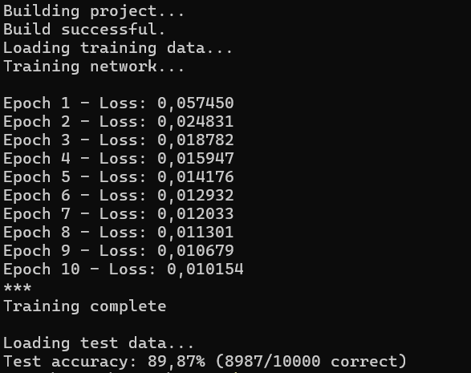

# MLP
Neural Network API for Java (Multilayer Perceptron architecture)

## Features
Activation options :
- Sigmoid
- ReLU
- TAHN

Weight initialization :
- Random
- Xavier (soon)
- HE (soon)

Confusion matrix computation

## Sample test

    int[] layers = new int[]{2, 2, 1} // 2 input neurons, 2 hidden, 1 output
    Network network = new Network(layers);

    // Default learning rate = 0.1
    network.setLearningRate(0.3);
    network.setActivationOption("SIGM");
    network.setWeightInitOption("RAND");

    // Train the network over X epochs using forward and backward propagation
    network.train(inputs, expectedOutputs, 10_000);

    // Display result
    double prediction = network.predict(inputs[1])[0];
    System.out.printf("AND gate prediction for (0, 1) : %f\n", prediction);


~ See Main.java ~

## Results
Using the MNIST dataset for digit recognition
```
Layers :                    [784, 64, 32, 10]
Learning rate :             0.02
Epochs :                    10
Activation :                Sigmoid
Weight initialisation :     Random
```

